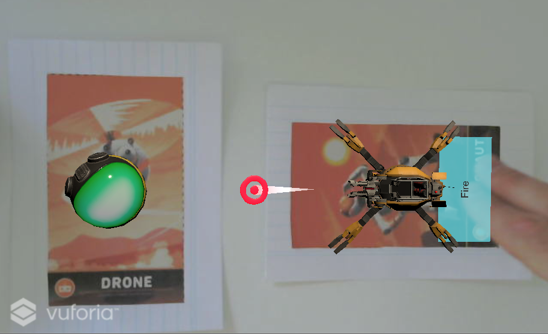

# Creating-AR-With-Vuforia

Basic AR app using the Vuforia Engine with Image Targets: Shooting a turret canon via an interactable button onto a drone.  

This project is based on an official Unity Tutorial.  

Refactored by adding a CustomTrackableEventHandler script.

